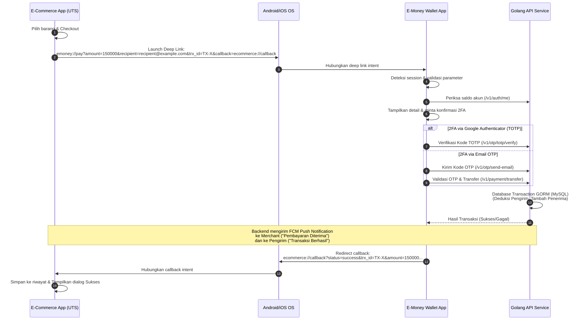

# UAS Mobile Programming - App-to-App Payment Integration Project

Proyek Ujian Akhir Semester (UAS) Mobile Programming ini mengintegrasikan **Aplikasi E-Commerce (Merchant)** yang dilanjutkan dari Ujian Tengah Semester (UTS) dengan **Aplikasi E-Money (Wallet)** menggunakan mekanisme **App-to-App Integration melalui Deep Link**, serta didukung oleh **Golang Backend** sebagai pemroses transaksi keuangan secara aman dengan verifikasi Two-Factor Authentication (2FA) dan notifikasi push Firebase Cloud Messaging (FCM).

---

## 📂 Struktur Proyek

Repositori monorepo ini memiliki struktur sebagai berikut:

- `/backend`: Layanan API backend berbasis Golang (Gin, GORM, Redis, MySQL).
- `/ecommerce_app`: Aplikasi Flutter E-Commerce (UTS Gaming Console Store) yang diperluas dengan opsi pembayaran E-Money, riwayat transaksi lokal, dan penanganan FCM.
- `/emoney_wallet`: Aplikasi Flutter secure wallet dengan visual bertema **Neubrutalism**, dilengkapi QR Scanner, verifikasi OTP/TOTP 2FA, dan deep link query.

---

## 🏗️ Arsitektur Aplikasi & Alur Transaksi

Aplikasi ini dirancang menggunakan arsitektur clean data flow dan deep link scheme:



---

## 🛠️ Daftar Dependensi Utama

### 1. Golang Backend
- `github.com/gin-gonic/gin`: Routing framework HTTP.
- `gorm.io/gorm` & `gorm.io/driver/mysql`: Database ORM dan driver MySQL.
- `github.com/redis/go-redis/v9`: Client cache untuk verifikasi OTP.
- `firebase.google.com/go/v4`: SDK admin untuk notifikasi Firebase Cloud Messaging.
- `github.com/pquerna/otp/totp`: Google Authenticator TOTP generator.
- `github.com/golang-jwt/jwt/v5`: Otentikasi sesi token JWT.

### 2. E-Commerce (Merchant) App (UTS)
- `provider`: State management terpusat.
- `url_launcher`: Membuka scheme link `emoney://pay`.
- `app_links`: Penanganan input deep link `ecommerce://callback`.
- `flutter_secure_storage`: Penyimpanan riwayat transaksi dan token lokal secara aman.
- `firebase_core` & `firebase_messaging`: Penerima push notifikasi transaksi.

### 3. E-Money (Wallet) App
- `app_links`: Penanganan input deep link `emoney://pay`.
- `qr_flutter`: Menampilkan QR Code rahasia untuk Google Authenticator 2FA.
- `firebase_core` & `firebase_messaging`: Otentikasi dan token client notifikasi push.
- `http`: Mengirim requests transfer dan otentikasi ke API Golang.

---

## 🚀 Cara Menjalankan Proyek

### 1. Persiapan Basis Data & Redis
Pastikan layanan berikut berjalan di localhost Anda:
- **MySQL**: Port `3306` (Gunakan database bernama `emoney`, user: `useremoney`, pass: `Password#123` atau sesuaikan `.env`).
- **Redis**: Port `6379` tanpa password.

### 2. Menjalankan Golang Backend
1. Masuk ke folder `/backend`.
2. Lengkapi konfigurasi berkas `.env` (SMTP Gmail untuk OTP dan path `firebase_service_account.json` jika ingin menggunakan notifikasi riil).
3. Jalankan aplikasi:
   ```bash
   go run main.go
   ```
4. Backend akan otomatis melakukan auto-migrate dan menyemai akun testing:
   - Pengirim / Wallet: `test@example.com` (Saldo awal Rp250.000)
   - Penerima / Merchant: `recipient@example.com` (Saldo awal Rp50.000)

### 3. Menjalankan Aplikasi Mobile (E-Commerce & Wallet)
Disarankan menggunakan dua Android Emulator atau perangkat fisik yang berbeda:

1. **Menjalankan E-Commerce (Merchant)**:
   ```bash
   cd ecommerce_app
   flutter pub get
   flutter run
   ```
2. **Menjalankan E-Money (Wallet)**:
   ```bash
   cd emoney_wallet
   flutter pub get
   flutter run
   ```

---

## 📸 Antarmuka Aplikasi (Screenshots)

*(Tempatkan tangkapan layar aplikasi Anda di folder `screenshots/` untuk presentasi)*

- **E-Money Wallet App (Neubrutalism)**:
  ``
  ``
- **E-Commerce App (Minimalist)**:
  ``
  ``
  ``

---

## 📺 Video Presentasi Aplikasi

Berikut adalah link presentasi demonstrasi alur transaksi proyek UAS:

👉 **[Tonton Video Demo Aplikasi di YouTube](https://youtube.com/)** *(Masukkan link video YouTube Anda di sini)*
